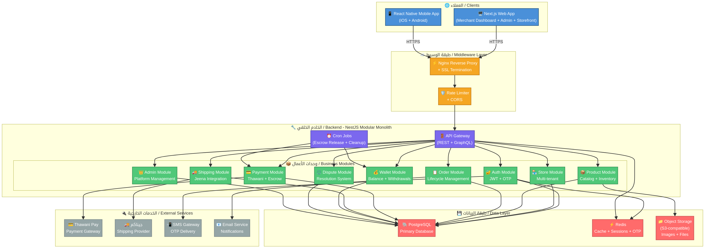
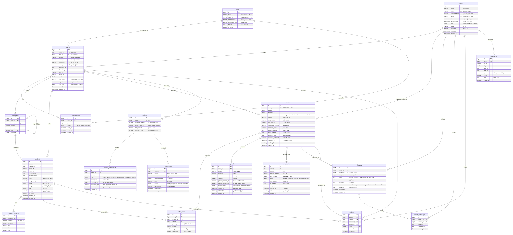
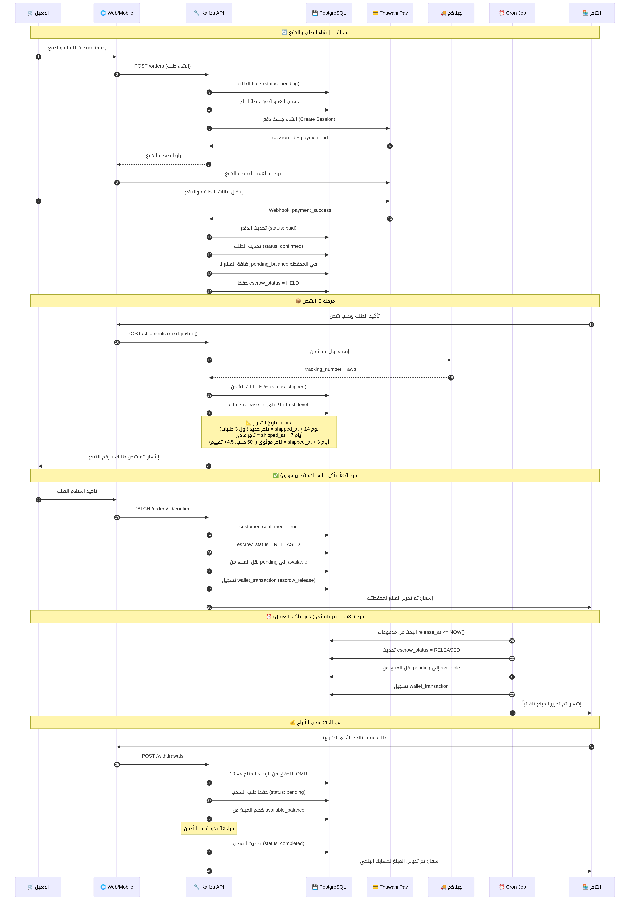
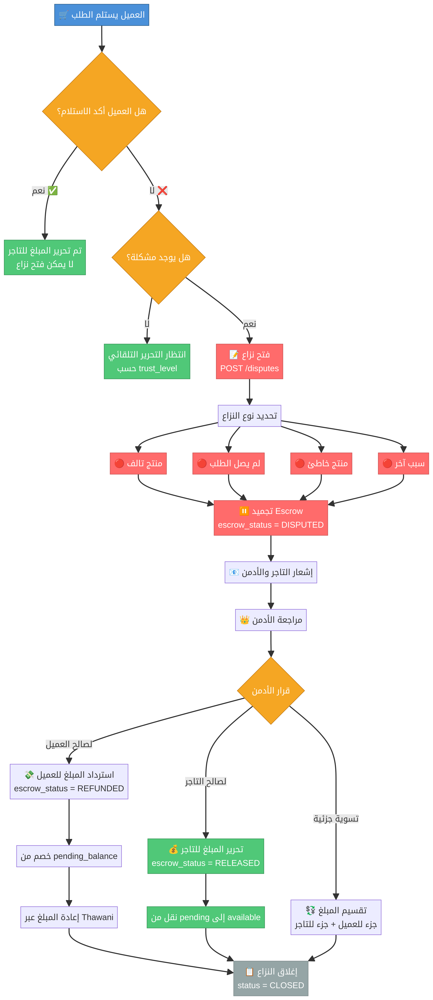
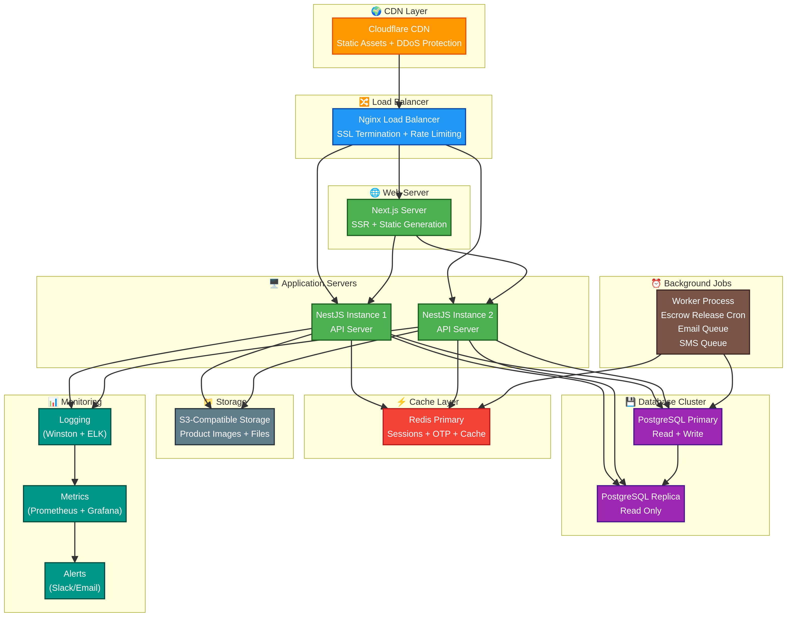

# وثيقة التصميم المعماري: منصة قفزة (Kaffza)

**الشركة:** جوهرة الشهباء الحديثة ش.م.م  
**المؤلف:** Manus AI  
**التاريخ:** 15 مارس 2026  
**الإصدار:** 1.0

---

## 1. نظرة عامة

منصة **قفزة (Kaffza)** هي أول منصة تجارة إلكترونية عُمانية متكاملة تعمل بنظام البرمجيات كخدمة (SaaS). تتيح المنصة للتجار في سلطنة عُمان إنشاء متاجرهم الإلكترونية وإدارتها بالكامل، مع توفير نظام دفع محلي عبر بوابة **Thawani Pay**، وشحن عبر **جيناكم**، ونظام ضمان مالي (Escrow) لحماية حقوق جميع الأطراف. المنصة مصممة لتكون ثنائية اللغة (عربي/إنجليزي) مع دعم كامل لاتجاه النص من اليمين لليسار (RTL)، وتعمل بعملة الريال العُماني حصرياً.

### 1.1 المكونات التقنية

| المكون | التقنية | الوصف |
| :--- | :--- | :--- |
| **Backend API** | Node.js + NestJS | خادم مركزي يوفر واجهة برمجة التطبيقات (REST API) لجميع العملاء |
| **قاعدة البيانات** | PostgreSQL 16 | قاعدة بيانات علائقية لتخزين جميع بيانات المنصة |
| **ORM** | Prisma | طبقة تجريد قاعدة البيانات مع Type Safety كامل |
| **التخزين المؤقت** | Redis 7 | لتخزين الجلسات، رموز OTP، والبيانات المؤقتة |
| **الويب** | Next.js 15 (React 19) | واجهة المتجر + لوحة تحكم التاجر + لوحة تحكم الأدمن |
| **الموبايل** | React Native (Expo) | تطبيق iOS و Android لإدارة المتجر |
| **إدارة المشروع** | Turborepo + pnpm | Monorepo لمشاركة الكود والأنواع بين جميع التطبيقات |
| **تخزين الملفات** | S3-compatible | لتخزين صور المنتجات والملفات المرفقة |

### 1.2 المميزات الأساسية

المنصة توفر مجموعة شاملة من الخدمات التي تغطي دورة حياة التجارة الإلكترونية بالكامل. كل تاجر يسجل في المنصة يحصل على متجره الخاص بنطاق فرعي مخصص (مثل: `storename.kaffza.om`)، مع إمكانية ربط نطاق مخصص في الخطط المتقدمة. النظام يدعم ثلاث خطط اشتراك بأسعار وعمولات مختلفة، مع نظام ضمان مالي (Escrow) ذكي يتكيف مع مستوى ثقة التاجر.

---

## 2. التصميم المعماري عالي المستوى

### 2.1 البنية العامة (System Architecture)



تم اعتماد بنية **Modular Monolith** للخادم الخلفي، وهي نفس البنية التي تستخدمها Shopify [1]. هذا النهج يجمع بين بساطة التطوير والنشر في المراحل الأولى، مع إمكانية التحول التدريجي إلى Microservices عند الحاجة. جميع العملاء (الويب والموبايل) يتواصلون مع خادم واحد عبر REST API محمي بـ JWT Authentication.

تتدفق الطلبات عبر طبقة وسيطة تشمل Nginx كـ Reverse Proxy مع SSL Termination و Rate Limiting، ثم تصل إلى API Gateway الذي يوجهها إلى الوحدة المناسبة. كل وحدة (Module) مسؤولة عن مجال عمل محدد ولها حدود واضحة، مما يسهل الصيانة والتطوير المستقل.

### 2.2 بنية Monorepo

المشروع بأكمله يُدار في مستودع واحد (Monorepo) باستخدام Turborepo و pnpm workspaces. هذا يتيح مشاركة الكود المشترك (الأنواع، المُصادقات، الثوابت) بين جميع التطبيقات مع الحفاظ على استقلالية كل تطبيق في البناء والنشر.

```
kaffza-oman/
├── apps/
│   ├── api/          ← NestJS Backend (Port 4000)
│   ├── web/          ← Next.js Web App (Port 3000)
│   └── mobile/       ← React Native (Expo)
├── packages/
│   ├── types/        ← TypeScript interfaces مشتركة
│   ├── validators/   ← Zod schemas مشتركة
│   ├── tsconfig/     ← إعدادات TypeScript مشتركة
│   └── config/       ← إعدادات ESLint/Prettier
├── docs/             ← الوثائق والمخططات
├── docker-compose.yml
├── turbo.json
└── pnpm-workspace.yaml
```

الحزم المشتركة (`packages/`) تُستورد في كل تطبيق كـ workspace dependencies، مما يضمن أن أي تغيير في الأنواع أو قواعد التحقق ينعكس فوراً على جميع التطبيقات.

---

## 3. تصميم قاعدة البيانات

### 3.1 مخطط العلاقات (ER Diagram)



قاعدة البيانات مصممة لدعم بنية متعددة المستأجرين (Multi-tenancy) على مستوى الصفوف (Row-level)، حيث يرتبط كل سجل بـ `store_id` الخاص به. تم استخدام Prisma كـ ORM لضمان Type Safety الكامل والتوافق مع TypeScript.

### 3.2 الجداول الرئيسية

| الجدول | الوصف | العلاقات الرئيسية |
| :--- | :--- | :--- |
| `users` | المستخدمون (أدمن، تجار، عملاء) مع دعم OTP | يملك متاجر، يضع طلبات |
| `plans` | خطط الاشتراك الثلاث مع الأسعار والعمولات | ترتبط بالمتاجر والاشتراكات |
| `stores` | المتاجر مع مستوى الثقة (trust_level) | تملك منتجات، طلبات، محفظة |
| `products` | المنتجات مع دعم المتغيرات (variants) | تنتمي لمتجر وتصنيف |
| `orders` | الطلبات مع حساب العمولة التلقائي | ترتبط بالدفع والشحن والنزاعات |
| `payments` | المدفوعات مع حالة Escrow وتاريخ التحرير | ترتبط بطلب واحد |
| `wallets` | محافظ التجار (رصيد متاح + معلق) | لكل متجر محفظة واحدة |
| `wallet_transactions` | سجل كامل لكل حركة مالية | ترتبط بالمحفظة |
| `disputes` | النزاعات مع نظام رسائل مدمج | ترتبط بطلب ومستخدم |

### 3.3 نقاط تصميمية مهمة

تم تصميم قاعدة البيانات مع مراعاة عدة نقاط جوهرية. أولاً، جميع الأعمدة المالية تستخدم نوع `Decimal(10,3)` لدعم دقة الريال العُماني (3 خانات عشرية للبيسة). ثانياً، جدول `payments` يحتوي على فهرس مركب على `(escrow_status, release_at)` لتسريع استعلامات Cron Job اليومية لتحرير الأموال. ثالثاً، كل جدول يستخدم `snake_case` في أسماء الأعمدة مع تعيين `@map` في Prisma للتوافق مع اصطلاحات PostgreSQL.

---

## 4. الخادم الخلفي (Backend Architecture)

### 4.1 وحدات الخدمات



يتكون الخادم الخلفي من 9 وحدات رئيسية، كل منها مسؤولة عن مجال عمل محدد:

| الوحدة | المسؤوليات | نقاط النهاية الرئيسية (API Endpoints) |
| :--- | :--- | :--- |
| **Auth** | تسجيل، دخول، OTP، JWT، إدارة الأدوار | `POST /auth/register`, `POST /auth/login`, `POST /auth/otp/send`, `POST /auth/otp/verify` |
| **Stores** | إنشاء وإدارة المتاجر، الاشتراكات | `POST /stores`, `GET /stores/:subdomain`, `PATCH /stores/:id` |
| **Products** | كتالوج المنتجات، المخزون، التصنيفات | `POST /stores/:id/products`, `GET /products`, `PATCH /products/:id` |
| **Orders** | دورة حياة الطلب، حساب العمولات | `POST /orders`, `GET /orders/:id`, `PATCH /orders/:id/status` |
| **Payments** | Thawani Pay، Escrow، Webhooks | `POST /stores/:storeId/payments/create-session`, `POST /payments/webhook` |
| **Shipping** | جيناكم (Mock)، بوالص الشحن، التتبع | `POST /shipments`, `GET /shipments/:id/track` |
| **Wallets** | الأرصدة، السحب، سجل المعاملات | `GET /wallets/me`, `POST /wallets/withdraw`, `GET /wallets/transactions` |
| **Disputes** | فتح وإدارة النزاعات، الرسائل | `POST /disputes`, `PATCH /disputes/:id/resolve` |
| **Admin** | إدارة المنصة، التقارير، الموافقات | `GET /admin/dashboard`, `GET /admin/stores`, `PATCH /admin/withdrawals/:id` |

### 4.2 نظام المصادقة (Authentication)

نظام المصادقة يعتمد على **JWT (JSON Web Tokens)** مع دعم **OTP** للتحقق من رقم الهاتف. عند التسجيل، يتم إرسال رمز OTP مكون من 6 أرقام إلى رقم الهاتف العُماني عبر SMS Gateway. الرمز يُخزن مشفراً في Redis مع مدة صلاحية 5 دقائق. بعد التحقق، يتم إصدار زوج من الرموز: Access Token (صلاحية 15 دقيقة) و Refresh Token (صلاحية 7 أيام).

النظام يدعم 3 أدوار: **Admin** (مدير المنصة)، **Merchant** (التاجر)، و **Customer** (العميل). كل نقطة نهاية محمية بـ Guard يتحقق من الدور المطلوب.

### 4.3 نظام العمولات (Commission Engine)

عند إنشاء طلب ناجح، يتم حساب العمولة تلقائياً بناءً على خطة اشتراك المتجر:

| الخطة | السعر الشهري | نسبة العمولة | مثال: طلب بقيمة 100 ر.ع |
| :--- | :--- | :--- | :--- |
| **البداية** | 5 ر.ع | 2% | عمولة: 2 ر.ع → التاجر: 98 ر.ع |
| **النمو** | 8 ر.ع | 1% | عمولة: 1 ر.ع → التاجر: 95 ر.ع |
| **المحترف** | 35 ر.ع | 0.5% | عمولة: 0.5 ر.ع → التاجر: 99.5 ر.ع |

لا توجد رسوم تسجيل. المبلغ المتبقي بعد خصم العمولة يُضاف إلى `pending_balance` في محفظة التاجر حتى يتم تحريره من نظام الضمان.

### 4.4 نظام الضمان المالي (Escrow System)

نظام الضمان هو القلب المالي للمنصة. عند دفع العميل، لا تُحوَّل الأموال مباشرة للتاجر، بل تُحتجز في المنصة حتى يتم التأكد من وصول الطلب بنجاح.

**قواعد تحرير الأموال:**

| مستوى الثقة | الشرط | مدة الاحتجاز |
| :--- | :--- | :--- |
| **تاجر جديد** | أول 3 طلبات | 14 يوم من تأكيد الشحن |
| **تاجر عادي** | 4-49 طلب أو تقييم أقل من 4.5 | 7 أيام من تأكيد الشحن |
| **تاجر موثوق** | +50 طلب مكتمل وتقييم 4.5+ | 3 أيام من تأكيد الشحن |

**ملاحظات مهمة:**
- المدة تبدأ من **تأكيد الشحن** وليس من تاريخ الطلب.
- إذا أكد العميل الاستلام، تُحرر الأموال **فوراً** بغض النظر عن المدة.
- بعد تأكيد العميل للاستلام، **لا يمكنه الاسترجاع** إلا عبر فتح نزاع قبل التأكيد.
- يعمل **Cron Job** يومياً للتحقق من المدفوعات التي حان وقت تحريرها.

### 4.5 نظام النزاعات



يمكن للعميل فتح نزاع **فقط قبل تأكيد الاستلام**. عند فتح نزاع، يتم تجميد الأموال في حالة `DISPUTED` ويتم إشعار التاجر وأدمن المنصة. الأدمن يراجع النزاع ويتخذ أحد ثلاثة قرارات: لصالح العميل (استرداد كامل)، لصالح التاجر (تحرير الأموال)، أو تسوية جزئية.

### 4.6 بوابة الدفع (Thawani Pay)

التكامل مع Thawani Pay يتم عبر REST API. مفاتيح الـ API تُخزن كمتغيرات بيئة (Environment Variables) ويتم استخدام بيئة الاختبار (UAT) حالياً. عند الحصول على الموافقة والمفاتيح الحقيقية، يكفي تغيير المتغيرات البيئية للانتقال إلى الإنتاج.

### 4.7 خدمة الشحن (جيناكم — Mock)

تم بناء واجهة برمجة تطبيقات وهمية (Mock API) تحاكي وظائف جيناكم الأساسية: إنشاء بوليصة شحن، تتبع الشحنة، وتحديث الحالة. عند توفر وثائق API الحقيقية، يتم استبدال Mock بالتكامل الفعلي دون تغيير في بقية النظام بفضل نمط Adapter Pattern.

---

## 5. الواجهات الأمامية

### 5.1 تطبيق الويب (Next.js)

تطبيق الويب مقسم إلى 3 أقسام رئيسية تعمل ضمن تطبيق Next.js واحد باستخدام App Router:

| القسم | المسار | الوصف |
| :--- | :--- | :--- |
| **واجهة المتجر** | `/{subdomain}/*` | صفحات المتجر العامة (منتجات، سلة، دفع) |
| **لوحة التاجر** | `/dashboard/merchant/*` | إدارة المنتجات، الطلبات، المحفظة، الإعدادات |
| **لوحة الأدمن** | `/dashboard/admin/*` | إدارة المنصة، المتاجر، النزاعات، التقارير |

يتم استخدام **next-intl** لدعم اللغتين العربية والإنجليزية مع تبديل تلقائي لاتجاه النص (RTL/LTR). التصميم يعتمد على **Tailwind CSS** مع مكونات مخصصة.

### 5.2 تطبيق الموبايل (React Native)

تطبيق الموبايل مبني بـ **React Native** عبر **Expo** ويستهدف نظامي iOS و Android. يوفر التطبيق بشكل أساسي لوحة تحكم للتاجر لإدارة متجره أثناء التنقل، مع إشعارات فورية (Push Notifications) لتنبيهات الطلبات والنزاعات.

التطبيق يشارك مع تطبيق الويب: الأنواع (Types)، قواعد التحقق (Validators)، واستدعاءات API. لكن واجهة المستخدم مبنية بمكونات React Native أصلية لضمان أفضل أداء وتجربة مستخدم.

---

## 6. بنية النشر (Deployment Architecture)



بيئة التطوير المحلية تعمل عبر Docker Compose الذي يوفر PostgreSQL و Redis و MinIO (بديل S3 محلي). للإنتاج، يُنصح باستخدام خدمات مُدارة مثل AWS RDS لقاعدة البيانات و ElastiCache لـ Redis، مع نشر التطبيقات على حاويات Docker عبر AWS ECS أو خادم VPS مع Nginx.

---

## 7. الأمان

تم تصميم المنصة مع مراعاة أفضل ممارسات الأمان. جميع الاتصالات تتم عبر HTTPS مع SSL/TLS. كلمات المرور تُشفر باستخدام bcrypt. رموز OTP تُخزن في Redis مع مدة صلاحية محدودة. Rate Limiting يحمي من هجمات DDoS وBrute Force. Helmet يضيف رؤوس أمان HTTP. CORS مُعد بدقة للسماح فقط للنطاقات المعتمدة. جميع المدخلات تُتحقق عبر Zod schemas مشتركة بين Frontend و Backend.

---

## 8. المراجع

[1]: [Shopify Engineering: Deconstructing the Monolith](https://shopify.engineering/deconstructing-monolith-designing-software-maximizes-developer-productivity) — Shopify's approach to modular monolith architecture  
[2]: [SaaS Architecture Best Practices — CloudZero](https://www.cloudzero.com/blog/saas-architecture/) — Multi-tenant SaaS design principles  
[3]: [Thawani E-Commerce API Documentation](https://thawani-technologies.stoplight.io/docs/thawani-ecommerce-api/) — Thawani payment gateway integration guide  
[4]: [Turborepo Documentation](https://turbo.build/repo/docs) — Monorepo management with Turborepo  
[5]: [NestJS Documentation](https://docs.nestjs.com/) — NestJS framework official documentation  
[6]: [Prisma Documentation](https://www.prisma.io/docs) — Prisma ORM for Node.js and TypeScript  
